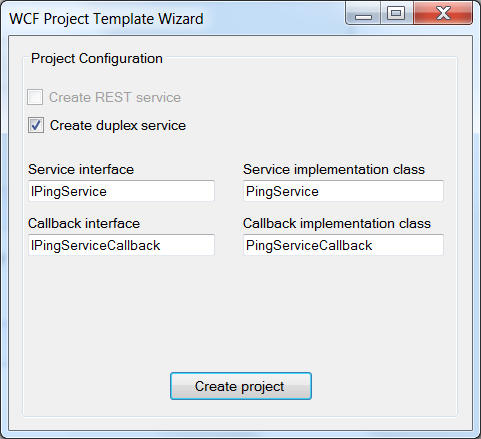
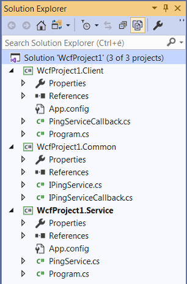

**WCFProjectTemplate** is a multi-project Visual Studio extension to quickly get you started with WCF clients and services.

It's primary purpose is to provide the usual boilerplate code via a few clicks thus supporting quick experimentation with WCF.

It ships with a simple wizard that let's you specify things like  the generated type names; whether you want to create a duplex service; or use \"plain old XML\" (POX) style messaging instead of SOAP-based messaging.

The generated project structure will be something like this:

To install the extension, pick one of these options:
* Install from within Visual Studio 2017 / 2019.
* Download the .vsix from [Visual Studio Marketplace](https://marketplace.visualstudio.com/items?itemName=tvass83.WCFProjectTemplate).
* Download the latest release from [GitHub](https://github.com/tvass83/WCFProjectTemplate/releases/latest) directly.

If you like the project please consider a small donation via
